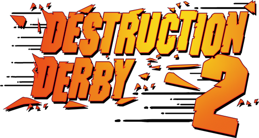

# Extraction Derby 2



Asset extractor for **Destruction Derby 2** (PlayStation, 1996).

Reads the game's `DIRINFO` archive straight off the disc and converts its
contents into modern formats:

- **Cars** as textured GLB models, one per livery, including the player car's
  three class variants. Body plus four wheels as separate named nodes.
- **Tracks** as textured GLB models, one per track, covering the road surface,
  landscape, grandstands and other scenery. Pine Hills' animated head and
  signpost are included with their rotation animation baked to keyframes.
- **Textures** as PNG, every tile in every level.

Textures are embedded inside the GLB files, so each model is self-contained and
opens directly in Blender or any other glTF viewer.

## Requirements

- Python 3.12 or newer
- [uv](https://docs.astral.sh/uv/)
- A `DIRINFO` file from an original Destruction Derby 2 disc

## Usage

```
uv run main.py <path_to_DIRINFO>
```

Everything is written to `output/`:

```
output/
    gamedata/    the unpacked DIRINFO archive
    cars/        car models (.glb)
    tracks/      track models (.glb), with props/ for standalone prop models
    textures/    texture tiles (.png), per level
    logs/        run log and detailed per-level reports
```

The output directory is wiped at the start of every run. It refuses to delete a
directory it did not create.

### Options

| Option | Effect |
|---|---|
| `-o`, `--output` | Output directory (default `output`) |
| `--scale` | Model units per output unit (default 1/256) |
| `--named-only` | Export only named textures, skipping road and scenery tiles |
| `--no-textures` | Skip texture extraction |
| `--no-cars` | Skip car models |
| `--no-tracks` | Skip track models |
| `-v`, `--verbose` | Mirror the log to the console |

## Notes

The extractor validates as it goes and fails loudly rather than writing
plausible but wrong output. Structural checks cover the archive, the VRAM
layout, polygon index ranges and the triangle count of every exported mesh.
Detailed findings for each level land in `output/logs/`.

`tools/render_glb.py` is a small software renderer used to check exported
models without a GPU:

```
uv run tools/render_glb.py output/cars/car_88.glb preview.png
uv run tools/render_glb.py output/tracks --sheet tracks.png
```

## Support
Reverse engineering is a lot of work, even with AI support.  
If you’d like to support me, feel free to toss me a coin for a tea or a burger.  
Thanks a lot for considering!

#### Patreon
[Support me via Patreon](https://www.patreon.com/cw/AcidicVoid/membership)

#### Crypto
<table>
  <tr>
    <td>BTC (BIP84)</td>
    <td>bc1qu29uqhp2rg7845n4wy6fhax0fgp4eajadxp45z</td>
  </tr>
  <tr>
    <td>ETH</td>
    <td>0xCAE2f86E4658b3FC0E753A2143E5dCC09Edff694</td>
  </tr>
  <tr>
    <td>BONK</td>
    <td>25ePWvR1e8LxeJpz2E2LDB3gUjtCC1dtEg5umSWjAtTV</td>
  </tr>
</table>
